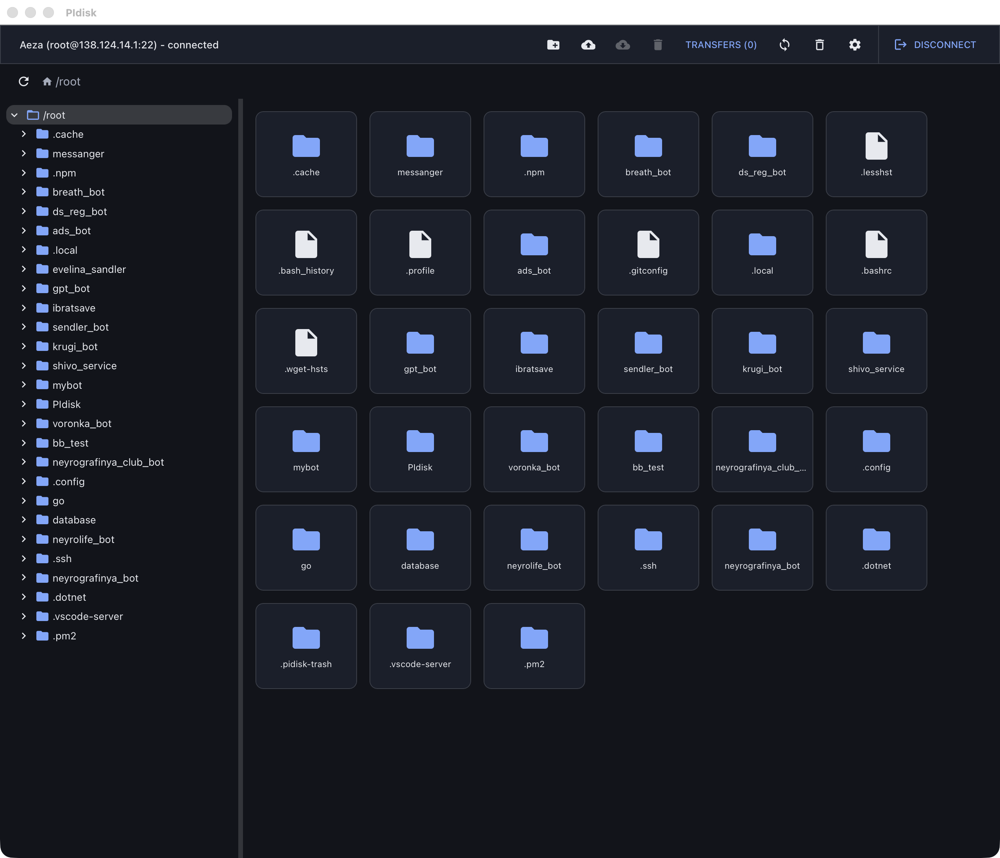
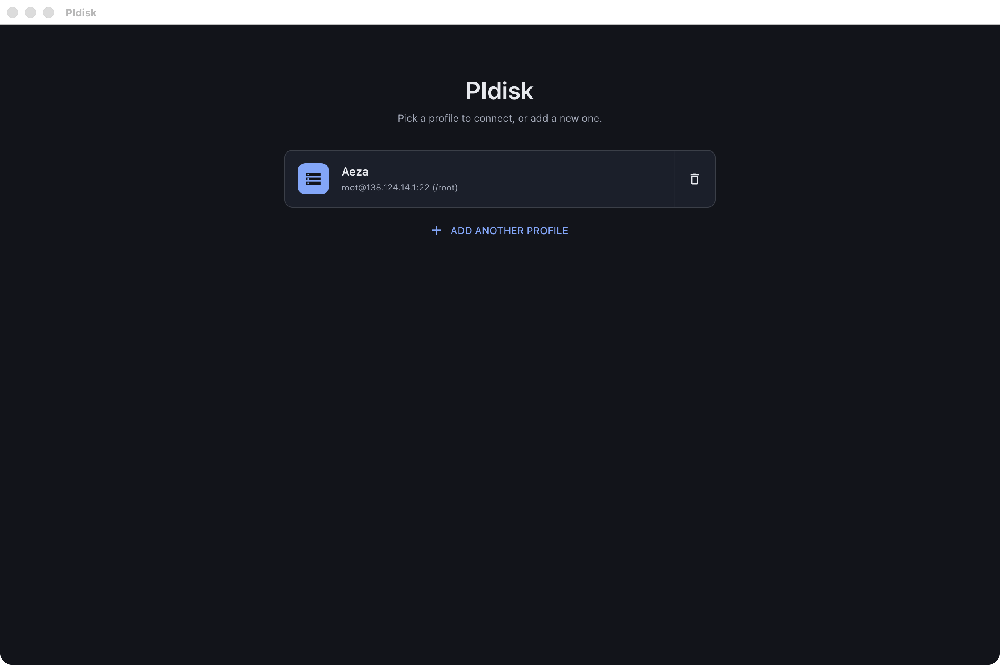
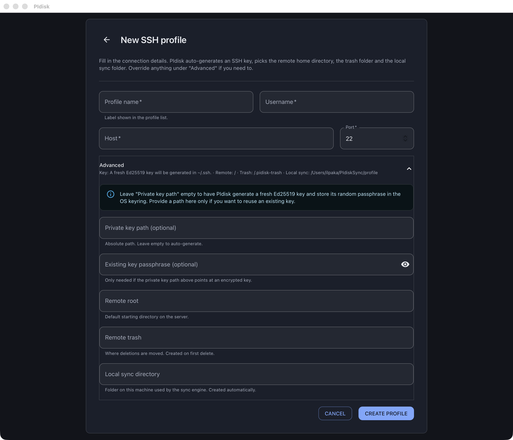
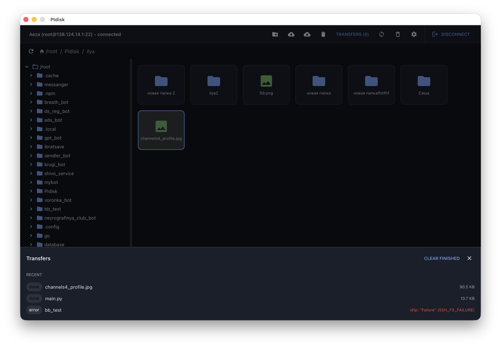
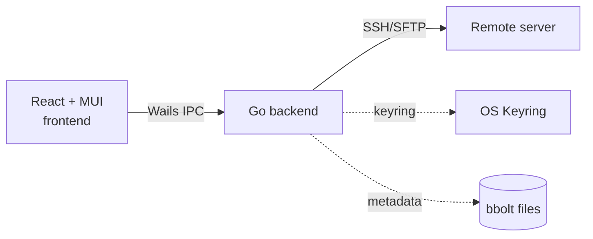

<h1 align="center">PIdisk</h1>

<p align="center">
  <a href="README.md"></a>
  <a href="README.ru.md"></a>
</p>

<p align="center">
  <b>A cross-platform SFTP file manager that doesn't get in your way.</b><br/>
  Two-way folder sync, key-only auth, OS keyring for secrets. macOS, Windows, Linux.
</p>

<p align="center">
  
  
  
  
  
  
</p>

<p align="center">
  
</p>

---

## What it does

PIdisk connects to a server over SSH, lets you browse and edit remote files like a regular file manager, and keeps selected folders in sync between your machine and the server. No web UI, no Docker, no agents on the server side. Just SSH.

## Features

- **Key-only SSH** with TOFU host verification. Generates a fresh Ed25519 key for each profile automatically.
- **Two-way folder sync** with last-writer-wins resolution and `.pidiskignore` (gitignore syntax).
- **Drag and drop** files into the folder tree to move them.
- **Trash with restore.** Deletions go to a per-profile trash folder and can be put back.
- **Concurrent transfers** that saturate gigabit links. Progress bar, cancel mid-flight.
- **Dark mode** plus hotkeys: F2 rename, Del trash, Esc clear, Ctrl/Cmd+A select all, F5 refresh.
- **Resizable folder tree** with persisted width.
- **Auto-reconnect** when the network blips, without losing your active profile.
- **OS keyring** (macOS Keychain / Credential Manager / Secret Service) for every passphrase.
- **Native bundles** for macOS (.app), Windows (.exe), Linux (AppImage / binary).

## Screenshots

<table>
  <tr>
    <td align="center">
      <br/>
      <sub>Login: pick a profile or create a new one</sub>
    </td>
    <td align="center">
      <br/>
      <sub>Create profile: four fields, the rest is automatic</sub>
    </td>
  </tr>
  <tr>
    <td align="center">
      <br/>
      <sub>Files: resizable tree, breadcrumbs, drag and drop</sub>
    </td>
    <td align="center">
      <br/>
      <sub>Transfers: live progress, cancellable</sub>
    </td>
  </tr>
</table>

## Install

Native bundles are produced by GitHub Actions for each tag. Download from the
[Releases](../../releases) page.

## Build from source

```bash
# Toolchain
brew install go node                                                  # macOS
go install github.com/wailsapp/wails/v2/cmd/wails@v2.11.0

# Linux only
sudo apt-get install -y libgtk-3-dev libwebkit2gtk-4.1-dev

# Run with hot reload
cd frontend && npm install && cd ..
wails dev

# Release bundle for the current platform
wails build -clean
```

## How it works



A single Go binary embeds the React UI as static assets and talks to the
server over `golang.org/x/crypto/ssh` plus `pkg/sftp`. Secrets live in the
native OS keyring; profiles and trash metadata sit in a few small bbolt
files in the user data directory.

## Documentation

- [Architecture](docs/ARCHITECTURE.md): layout, dependency direction, event flow.
- [Security](docs/SECURITY.md): threat model and what is intentionally not supported.
- [Profiles](docs/PROFILES.md): profile lifecycle, storage layout, keyring details.
- [Sync](docs/SYNC.md): sync loop, diff algorithm, ignore handling.

## Roadmap

- Embedded terminal tab (xterm.js)
- Bookmarks for frequent paths
- Side by side dual-pane mode
- Versioned trash entries
- Profile import / export

## License

MIT. See [LICENSE](./LICENSE).
