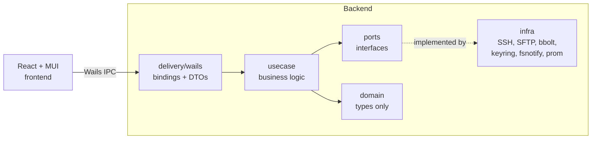

<h1 align="center">PIdisk</h1>

<p align="center">
  <b>A cross-platform SFTP file manager that doesn't get in your way.</b><br/>
  Two-way folder sync, key-only auth with TOFU, OS keyring for secrets, native bundles for macOS, Windows, Linux.
</p>

<p align="center">
  
  
  
  
  
  
</p>

<p align="center">
  
</p>

---

## Why this exists

PIdisk started as an internal Tauri prototype that worked locally but had three problems that made it impossible to ship publicly:

- **Credentials in the repo.** Host, user, and a production password sat in `settings.json`. The first commit history shows it.
- **Memory and shell injection.** Uploads buffered the entire file into a `Vec<u8>` before sending. File operations were built by string-concatenation: `format!("cd '{}' && mkdir '{}'", path, name)`. No escaping.
- **No reconnect, no host-key check.** The session was a single `Mutex<Option<Session>>` that broke on any network blip, and trusted whatever host key the server sent on the first handshake forever.

The rewrite was an excuse to do it properly: a credible security model, a clean architecture, and a UI that survives daily use. This repo is the result.

The original sources are frozen under [`legacy/tauri-pidisk/`](./legacy/tauri-pidisk) as a behavioural reference. Nothing in there is built.

---

## Highlights

| Area | What was done |
| --- | --- |
| **Authentication** | Key-only SSH (RSA, ECDSA, Ed25519). Password auth is intentionally not supported. Auto-generates an Ed25519 keypair with a strong random passphrase on first profile creation. |
| **Trust** | TOFU known-hosts: first connection prompts to confirm the fingerprint, mismatches are blocked, entries are stored in OpenSSH format under the user config dir. |
| **Secrets** | OS keyring (`com.pidisk.profiles`) via `zalando/go-keyring`. Nothing on disk is encrypted at rest because nothing on disk is a secret: bbolt holds metadata, the keyring holds the passphrase. |
| **Transfers** | `pkg/sftp` tuned for gigabit (32 KiB packets, 64 in-flight requests per file, concurrent reads/writes). Streaming uploads with progress callbacks throttled to 200 ms per transfer. Concurrent folder downloads via `errgroup` with a worker semaphore. |
| **Sync** | One goroutine per enabled folder, fsnotify for incremental triggers with 500 ms debounce, periodic full diff on a configurable interval. Last-writer-wins with a 2 s mtime tolerance, `.pidiskignore` honoured (gitignore syntax). |
| **Resilience** | 30 s SSH keepalive, exponential reconnect (1 s start, 30 s cap) without losing the active profile. |
| **UI** | React 18 + MUI 6 + Zustand. Dark mode, hotkeys (F2 rename, Del trash, Esc clear selection, Ctrl/Cmd+A select all, F5 refresh), drag-and-drop into the folder tree, resizable sidebar with persisted width, host-key confirmation dialog. |
| **Trash** | Deletions are moved into a per-profile trash directory and recorded in bbolt so they can be restored to their original path. |
| **Observability** | Optional Prometheus exporter on loopback. Structured logs via `zerolog` with `lumberjack` rotation (20 MB, 5 backups, 30 days). |
| **Distribution** | Native bundles via `wails build`. GitHub Actions matrix builds macOS / Windows / Linux artefacts on tag push. CGo on macOS/Windows, GTK on Linux. No Docker, no Electron. |

## Architecture at a glance

PIdisk follows a hexagonal-ish layout. The dependency direction is strict: `delivery` and `infra` both depend on `usecase`, `usecase` depends only on `ports` and `domain`, and `domain` depends on nothing.



DI is wired by hand in `main.go`. No `wire`, no `fx`, no magic. Roughly 90 lines that read top-to-bottom.

The full guide lives at [docs/ARCHITECTURE.md](./docs/ARCHITECTURE.md). Specifics:
- [docs/SECURITY.md](./docs/SECURITY.md) -- threat model and what is intentionally not supported.
- [docs/PROFILES.md](./docs/PROFILES.md) -- profile lifecycle, storage layout, keyring integration.
- [docs/SYNC.md](./docs/SYNC.md) -- sync loop, diff algorithm, ignore handling.

---

## Tech stack

| Layer | Choice | Why |
| --- | --- | --- |
| Backend runtime | **Go 1.23** | Fast cold start, single static binary, great stdlib for I/O. |
| Desktop shell | **Wails v2** | Native WebView (WebKit / WebView2 / WebKitGTK). 10x smaller bundles than Electron, no Node runtime in the app. |
| SSH / SFTP | **`golang.org/x/crypto/ssh` + `pkg/sftp`** | Standard, audited, supports concurrent SFTP reads/writes (OpenSSH 6.7+). |
| Persistence | **bbolt + TOML** | Embedded, zero-dep, file-backed. bbolt for fast key-value, TOML for human-edited settings. |
| Secrets | **`zalando/go-keyring`** | Native Keychain / Credential Manager / Secret Service. |
| Watcher | **`fsnotify`** | Inotify / FSEvents / ReadDirectoryChangesW under one API. |
| Logging | **`rs/zerolog` + `lumberjack`** | Structured JSON, allocation-free for the common path, rotation included. |
| Metrics | **`prometheus/client_golang`** | Optional, exposed on loopback only when enabled in settings. |
| Frontend | **React 18 + TypeScript + MUI 6 + Zustand + Vite** | Mature, typed, no obscure deps. Zustand because Redux is overkill for this. |

---

## Quick start

```bash
# Toolchain
brew install go node                       # macOS; use your distro's packages on Linux
go install github.com/wailsapp/wails/v2/cmd/wails@v2.11.0

# Linux only -- GTK / WebKit dev headers
sudo apt-get install -y libgtk-3-dev libwebkit2gtk-4.1-dev

# Develop with hot reload
cd frontend && npm install && cd ..
wails dev

# Release bundle for the current platform
wails build -clean
# -> build/bin/PIdisk.app (macOS) / PIdisk.exe (Windows) / pidisk (Linux)
```

Cross-platform release pipeline runs on tag push (`v*`). See [.github/workflows/release.yml](./.github/workflows/release.yml).

---

## Engineering notes

A handful of decisions worth reading the code for.

### Cleaner DI than a framework

The whole graph is in [`main.go`](./main.go). Constructors take exactly what they need; tests can swap in fakes without touching production wiring.

```go
profilesUC := usecase.NewProfilesUseCase(profileRepo, secrets)
broker     := usecase.NewHostKeyBroker()
connUC     := usecase.NewConnectionUseCase(profilesUC, khStore, bus, broker, logger)
filesUC    := usecase.NewFilesUseCase(connUC, logger)
trashUC    := usecase.NewTrashUseCase(connUC, trashRepo, profilesUC, bus, logger)
transferUC := usecase.NewTransferUseCase(connUC, bus, metricRecorder, logger)
syncUC     := usecase.NewSyncUseCase(connUC, profilesUC, syncRepo, bus, metricRecorder, logger)
```

### Throttled progress events

A naive implementation emits one event per `Write`. We rate-limit per transfer via `x/time/rate` so the UI repaints at most every 200 ms, while still guaranteeing the final 100% event:

```go
if done == total || entry.limiter.Allow() {
    uc.bus.Emit("transfer:progress", snapshot)
}
```

### Streaming uploads

The original Tauri code did `tokio::fs::read(path).await?` and shipped a `Vec<u8>` over IPC. 1 GiB file = 1 GiB resident memory plus a 1 GiB IPC payload. The Go version:

```go
src, _ := os.Open(localPath)
dst, _ := f.client.OpenFile(remote, os.O_WRONLY|os.O_CREATE|os.O_TRUNC)
io.Copy(&progressWriter{w: dst, done: &done}, src)
```

Constant memory, regardless of file size. `pkg/sftp` is configured for concurrent writes, so we saturate gigabit on LAN.

### TOFU host keys with async UI

The SSH `HostKeyCallback` runs synchronously inside `ssh.NewClientConn`. We need to surface an unknown host to React and wait for the user to click "Trust". The bridge is a tiny broker:

```go
func (b *HostKeyBroker) Prompter() sshclient.HostKeyPrompter {
    return func(entry domain.KnownHost) sshclient.HostKeyDecision {
        ch := b.pending[entry.Fingerprint]
        return <-ch   // blocks the SSH handshake until ConfirmHostKey fires
    }
}
```

The frontend listens for `hostkey:prompt`, shows a dialog, and calls `ConfirmHostKey(fingerprint, accept)`. The Go side unblocks and either trusts the key (saving it to `known_hosts`) or aborts.

### WebKit's broken `window.confirm` / `window.prompt`

Discovered the hard way: macOS WebKit silently disables `window.confirm` and `window.prompt` inside an embedded webview, so the click handlers that gated destructive actions like "Delete profile" appeared to do nothing. Replaced the lot with a Zustand-backed dialog system mounted once at the app root, exposing two helpers:

```ts
const ok = await confirmDialog({ message: "Delete profile?", destructive: true });
const name = await promptDialog({ label: "Folder name" });
```

### Case-sensitive identifiers vs WebKit auto-cap

WebKit also auto-capitalises the first character of text inputs by default. `root` becomes `Root`, SSH fails with `unable to authenticate`, user blames the app. Fixed by setting `autoCapitalize="none"`, `autoCorrect="off"`, `spellCheck={false}` on every identifier field.

---

## Security model (summary)

The full document is [docs/SECURITY.md](./docs/SECURITY.md). The TL;DR:

- Key-only SSH. Password auth was deliberately removed from the threat surface.
- TOFU host keys with explicit user confirmation. Mismatches refuse the connection rather than asking the user to override (no "trust all" toggle).
- Auto-generated SSH keys are Ed25519 with a 24-byte (192-bit) random passphrase, stored exclusively in the OS keyring. The user never sees or needs to type it.
- All file operations go through `pkg/sftp` calls. The only shell command we ever build is the `df` fallback when the server doesn't advertise the `statvfs@openssh.com` extension, and that path runs through a whitelist-based escaper.
- Path inputs are rejected if they contain `..`, NUL, CR, or LF before they reach the SFTP layer.

---

## Performance notes

| Workload | Result | How |
| --- | --- | --- |
| 1 GiB upload | RSS stays under 30 MiB; ~110 MB/s on gigabit LAN | `io.Copy` + `pkg/sftp` concurrent writes (`MaxConcurrentRequestsPerFile=64`, `MaxPacket=32 KiB`). |
| 1000-file folder download | Linear scale with worker count; ~8x speedup over sequential at 8 workers | `errgroup` + a buffered semaphore channel, single progress aggregator. |
| Sync diff over 50k files | < 200 ms per run on M-series; fsnotify triggers an incremental pass in ~50 ms | Two parallel snapshots (`filepath.Walk` + remote `ReadDir`), single-pass map diff, `.pidiskignore` matched once per relative path. |

Tuning knobs live in [`internal/infra/sftpfs/opts.go`](./internal/infra/sftpfs/opts.go); raise concurrency for high-latency WAN at the cost of memory.

---

## Repository layout

```
.
├── main.go                              Wails entry point and DI graph
├── internal/
│   ├── domain/                          types only, no imports
│   ├── usecase/                         business logic
│   ├── ports/                           interfaces implemented by infra
│   ├── infra/
│   │   ├── sshclient/                   SSH client + TOFU + reconnect
│   │   ├── sftpfs/                      pkg/sftp wrapper (upload, download, walk)
│   │   ├── keystore/                    OS keyring
│   │   ├── profiles/                    bbolt profile repo
│   │   ├── knownhosts/                  OpenSSH-format known_hosts
│   │   ├── trashrepo/                   bbolt trash metadata
│   │   ├── syncwatcher/                 fsnotify + diff + engine
│   │   ├── syncrepo/                    bbolt sync folders
│   │   ├── settingsrepo/                TOML settings
│   │   ├── eventbus/                    Wails runtime wrapper
│   │   ├── metrics/                     Prometheus exporter
│   │   └── logging/                     zerolog + lumberjack
│   ├── delivery/wails/                  Wails-bound bindings
│   ├── platform/                        OS-aware paths, shell escape, sshkeygen
│   └── version/                         set via ldflags at build time
├── frontend/                            React + MUI app
│   └── src/
│       ├── pages/                       Login, CreateProfile, Files, Settings
│       ├── components/                  FolderTree, FileGrid, TransferDrawer, ...
│       ├── stores/                      Zustand stores
│       ├── api/                         typed wrappers around Wails bindings
│       └── theme/                       MUI theme with proper contrast for dark mode
├── legacy/tauri-pidisk/                 frozen reference implementation
├── docs/                                ARCHITECTURE, SECURITY, PROFILES, SYNC
├── scripts/                             platform build helpers
└── .github/workflows/                   CI + release matrix
```

---

## Testing

```bash
go test ./...
npm --prefix frontend run typecheck
npm --prefix frontend run build
```

Coverage is concentrated in the usecase layer (the part where business logic lives). Unit tests use in-memory fakes for the ports so they run without a real SSH server or keyring. The `syncwatcher.Diff` algorithm has table-driven tests for the upload, download, no-op and bidirectional-conflict cases.

CI runs both halves on every push: [`.github/workflows/ci.yml`](./.github/workflows/ci.yml).

---

## Roadmap

- [ ] Embedded terminal tab (xterm.js bound to `ssh.Session().RequestPty + Shell`)
- [ ] Bookmarks for frequently used paths
- [ ] Side-by-side dual-pane mode
- [ ] Versioned trash entries (multiple copies kept by timestamp)
- [ ] Profile import/export (JSON, passphrase prompted on import)

---

## License

MIT. See [LICENSE](./LICENSE).
