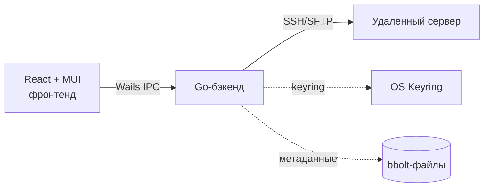

<h1 align="center">PIdisk</h1>

<p align="center">
  <a href="README.md"></a>
  <a href="README.ru.md"></a>
</p>

<p align="center">
  <b>Кросс-платформенный SFTP-менеджер, который не мешает работать.</b><br/>
  Двусторонняя синхронизация папок, аутентификация только по ключу, секреты в OS keyring. macOS, Windows, Linux.
</p>

<p align="center">
  
  
  
  
  
  
</p>

<p align="center">
  
</p>

---

## Что это

PIdisk подключается к серверу по SSH, даёт работать с удалёнными файлами как с обычным файловым менеджером и синхронизирует выбранные папки между твоей машиной и сервером. Без веб-интерфейса, без Docker, без агентов на сервере. Только SSH.

## Возможности

- **SSH только по ключу** с TOFU-проверкой fingerprint. Для каждого профиля автоматически генерируется новый Ed25519-ключ.
- **Двусторонняя синхронизация** с разрешением конфликтов по последнему изменению (LWW) и `.pidiskignore` (синтаксис gitignore).
- **Drag and drop** файлов прямо в дерево папок.
- **Корзина с восстановлением.** Удалённое попадает в персональную корзину профиля и возвращается на прежнее место одной кнопкой.
- **Параллельные передачи**, утилизируют гигабит. Прогресс-бар, отмена на лету.
- **Тёмная тема** и хоткеи: F2 переименовать, Del в корзину, Esc снять выделение, Ctrl/Cmd+A выделить всё, F5 обновить.
- **Регулируемая ширина дерева** папок с сохранением между запусками.
- **Авто-переподключение** при разрывах сети без потери активного профиля.
- **OS keyring** (macOS Keychain / Credential Manager / Secret Service) для всех passphrase.
- **Нативные сборки** под macOS (.app), Windows (.exe), Linux (AppImage / бинарь).

## Скриншоты

<table>
  <tr>
    <td align="center">
      <br/>
      <sub>Логин: выбор существующего профиля или создание нового</sub>
    </td>
    <td align="center">
      <br/>
      <sub>Создание профиля: четыре поля, остальное подставляется</sub>
    </td>
  </tr>
  <tr>
    <td align="center">
      <br/>
      <sub>Файлы: дерево с ресайзом, breadcrumbs, drag and drop</sub>
    </td>
    <td align="center">
      <br/>
      <sub>Передачи: живой прогресс, отмена в любой момент</sub>
    </td>
  </tr>
</table>

## Установка

Нативные сборки готовит GitHub Actions на каждый тег. Скачать можно
со страницы [Releases](../../releases).

## Сборка из исходников

```bash
# Toolchain
brew install go node                                                  # macOS
go install github.com/wailsapp/wails/v2/cmd/wails@v2.11.0

# Только Linux
sudo apt-get install -y libgtk-3-dev libwebkit2gtk-4.1-dev

# Запуск с hot reload
cd frontend && npm install && cd ..
wails dev

# Релизная сборка под текущую платформу
wails build -clean
```

## Как это устроено



Один Go-бинарь со встроенным React-фронтом ходит на сервер через
`golang.org/x/crypto/ssh` плюс `pkg/sftp`. Секреты лежат в нативном
OS keyring; профили и метаданные корзины — в нескольких маленьких
bbolt-файлах в пользовательской директории данных.

## Документация

- [Архитектура](docs/ARCHITECTURE.md): структура, направление зависимостей, поток событий.
- [Безопасность](docs/SECURITY.md): модель угроз и что намеренно не поддерживается.
- [Профили](docs/PROFILES.md): жизненный цикл, формат хранения, работа с keyring.
- [Синхронизация](docs/SYNC.md): цикл, алгоритм diff, обработка ignore.

## Roadmap

- Встроенная вкладка терминала (xterm.js)
- Закладки на часто используемые пути
- Двухпанельный режим (side by side)
- Версионирование удалений в корзине
- Импорт / экспорт профилей

## Лицензия

MIT. См. [LICENSE](./LICENSE).
